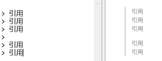
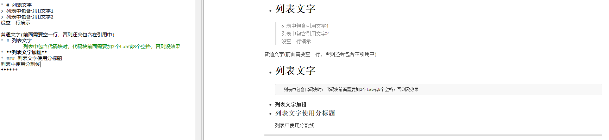

## 1.快捷键
**功能**|**快捷键**
:-:|:-:
加粗|Ctrl+B
斜体|Ctrl+I
引用|Ctrl+Q
插入链接|Ctrl+L
插入代码|Ctrl+K
插入图片|Ctrl+G
提升标题|Ctrl+H
有序列表|Ctrl+U
横线|Ctrl+R
撤销|Ctrl+Z
重做|Ctrl+Y

<!--more-->

## 2. 基本语法
### 2.1 字体设置斜体、粗体、删除线
	斜体： *这里是需要斜体的文字* 或 _这里是需要斜体的文字_
	粗体： **这里是需要粗体的文字**
	倾斜加粗：***这里是需要倾斜加粗的文字***
	删除线： ~~这里是需要删除线的文字~~	

### 2.2 分级标题
1、 写法一
```
一级标题：# 一级标题文字
二级标题：## 二级标题文字
三级标题：### 三级标题文字
四级标题：#### 四级标题文字
五级标题：##### 五级标题文字
六级标题：###### 六级标题文字
```
2、写法二
```
	一级标题文字
	========================
	二级标题文字
	------------------------
```
	
### 2.3 链接
#### 2.3.1 插入本地图片
	语法规则，有两种写法：
	1.
	2.
注意：图片描述可以不写，图片路径可以是相对路径也可以是绝对路径。

#### 2.3.2 插入互联网上图片
	
注意：图片描述可以不写。

#### 2.3.3 自动链接
	Markdown支持以比较简单的自动链接形式来处理网址和电子邮件信箱,只要用<>包起来,Markdown就会自动把它转成链接。如<www.baidu.com>
	也可以直接,也是可以显示成链接形式的。

### 2.4 分割块
	可以使用三个以上星号(*)、减号(-)或底线(_)来创建分隔线,星号、减号或底线之间可以加入空格。
	星号：***或* **
	减号：---或- - -
	底线：___或__ _

### 2.5 代码块

对于程序员来说,插入代码的功能是必不可少的,插入代码块的方式有两种
第一种是利用缩进(tab),第二种是用 ` 符号(一般在ESC键下方,和~是同一个键,需在英文输入法时输入)包裹代码

	1、代码块:缩进4个空格或1个制表符
	2、行内式:如果在行内需要引用代码,只要用反引号 ` 引起来就好
	3、多行代码块与语法高亮:将需要语法高亮的代码块的前后用3个 ` 包裹
	4、代码块里包含HTML代码:在代码块里面,&、< 和 会自动转换成HTML实体,简书代码块里不支持HTML


代码块里包含HTML代码示例如下:


### 2.6 引用
	在被引用的文本前加上 > 和一个空格,如果只输入一个 > 会产生一个空白的引用
1、基本使用如下图所示



2、引用的嵌套使用如下图所示


3、引用其他要素

	引用区块中也可以使用其他Markdown语法,包括标题、列表、代码砌块等。
使用如图所示:


### 2.7 列表
1、无序列表

	使用*、+、-表示无序列表。
注意:符号后面一定要有一个空格，起到缩进的作用。


2、有序列表

	使用数字和 . 表示有序列表
注意:.后面一定要有一个空格，起到缩进的作用


3、列表和其他要素混合使用
	
	列表不光可以单独使用，也可以配合其他Markdown语法使用，包括标题、引用、代码块等。
注意：
* 加粗效果不能直接用于列表标题，但可以嵌套在列表里面混合使用
* 列表中包含代码块时，**代码块前面需要加2个tab或8个空格，否则没效果**
使用示例如下图:


4、注意事项
在使用列表时只要是数字后面加上英文的点，就会无意间产生列表，比如2019.05.29 这时候想表达的是日期，有些软件把它被误认为是列表。
解决方式：在每个点前面加上\就可以了。如下图所示：


### 2.8 表格
表格的基本写法很简单，只需使用 | 将内容分隔开即可


表格对齐方式:冒号在左边表示左对齐，右边表示有对齐，两边都有表示居中。


## 3. 常用技巧
### 3.1 换行
	方法1:连续两个以上空格+回车
	方法2:使用html语言换行标签
### 3.2 缩进字符
```
一个汉字占两个空格大小，首行缩进有如下3种方法:
* 缩进一个空格: `&ensp;` 或 `&#8194;` 
* 缩进两个空格: `&emsp;` 或 `&#8195;`
* 不换行空格: `&nbsp;` 或 `&#160;`
```
**注意带上分号**


### 3.3 特殊字符
1. 对于Markdown中的语法符号，前面加转义字符 \ 即可显示符号本身。

2. 其他特殊字符
   

特殊字符支持表:

工具或网站|是否支持特殊字符
:-:|:-:
简书|是
MarkdownPad2|否(不知道付费版是否支持)
有道云笔记|是
zybuluo.com|是


### 3.4 字体、字号与颜色
Markdown是一种可以使用普通文本编辑器编写的标记语言，通过类似HTML的标记语法，它可以使普通文本内容具有一定的格式。但是它本身是不支持修改字体、字号与颜色等功能的！

CSDN-markdown编辑器是其衍生版本，扩展了Markdown的功能（如表格、脚注、内嵌HTML等等）！对，就是内嵌HTML，接下来要讲的功能就需要使用内嵌HTML的方法来实现。

字体，字号和颜色编辑如下代码
```
<font face="黑体">我是黑体字</font>
<font face="微软雅黑">微软雅黑</font>
<font face="STCAIYUN">我是华文彩云</font>
<font color=#0099ff size=7 face="黑体">color=#0099ff size=7 face="黑体"</font>
<font color=#00ffff size=4 face="黑体">color=#00ffff size=4 face="黑体"</font>
<font color=gray size=1 face="黑体">color=gray size=1 face="黑体"</font>
```
效果图如下:

颜色名列表:


### 3.5 链接的高级操作
#### 1. 行内式
详情参考 2\.3\.3 自动链接
#### 2. 参考式链接
格式为[链接描述][标记]，使用示例如下:
```
这是我们常用的地址:[百度][1]
[1]:www.baidu.com
```
效果:这是我们常用的地址:[百度][1]
[1]:www.baidu.com

#### 3. 内容目录
在文章开始填写 [TOC] 以显示全文内容的目录结构。
#### 4. 锚点
锚点其实就是页内超链接。比如我这里写下一个锚点，点击回到目录，就能跳转到目录。 在目录中点击这一节，就能跳过来。

注意：在简书中使用锚点时，点击会打开一个新的当前页面，虽然锚点用的不是很舒服，但是可以用注脚实现这个功能。

语法说明： 
在你准备跳转到的指定标题后插入锚点{#标记}，然后在文档的其它地方写上连接到锚点的链接。

使用如下图所示：


#### 5. 注脚
在需要添加注脚的文字后面加上[^注脚名字]，称为加注。然后再文本的任意位置(一般在最后)添加脚注，脚注前必须有对应的脚注名字。
使用示例:

	Markdown[^1]测试添加脚注[^2]方法。

	[^1]:Markdown是一种纯文本标记语言
	[^2]:就是脚注

#### 6. 背景色
Markdown本身不支持背景色设置，需要采用内置html的方式实现：借助 table, tr, td 等表格标签的 bgcolor 属性来实现背景色的功能。使用示例如下：
```
	<table>
		<tr>
			<td bgcolor=red>背景色是:red</td>
		</tr>
	</table>
```


#### 7. emoji表情符号
emoji表情使用`:EMOJICODE:`的格式，详细列表可见 
<https://www.webpagefx.com/tools/emoji-cheat-sheet/>  

表情符号支持列表:

工具或网站|是否支持emoji表情符号
:-:|:-:
简书|否
MarkdownPad2|否(不知道付费版是否支持)
有道云笔记|否
zybuluo.com|否
github|是


## 4. 高端用法
### 4.1 Latex数学公式
* 行内公式:使用两个 `$` 符号引用公式 `$公式$`
* 行间公式:使用两对 `$$` 符号引用公式 `$$公式$$`
详细内容请参考:
[markdown编辑器使用LaTex数学公式](https://blog.csdn.net/testcs_dn/article/details/44229085)
[常用数学符号的 LaTeX 表示方法](https://www.mohu.org/info/symbols/symbols.htm)

### 4.2 流程图

### 4.3 制作一份待办事宜——Todo列表

### 4.4 绘制序列图

### 4.5 绘制甘特图


## 5. Markdown工具
* windows推荐使用[MarkdownPad2](http://markdownpad.com/)
* Mac OS X推荐使用[Mou](http://25.io/mou/)，这是一款免费且十分好用的Markdowm编辑器
* Web端推荐使用[简书](https://www.jianshu.com)
**************

本文参考链接: <https://blog.csdn.net/u014061630/article/details/81359144>