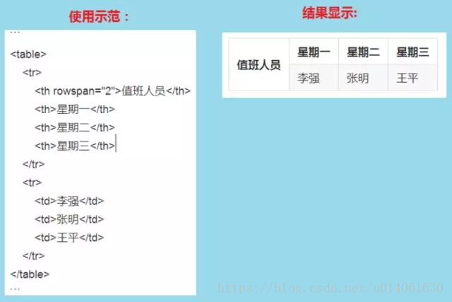

## 1.快捷键
**功能**|**快捷键**
:-:|:-:
加粗|Ctrl+B
斜体|Ctrl+I
引用|Ctrl+Q
插入链接|Ctrl+L
插入代码|Ctrl+K
插入图片|Ctrl+G
提升标题|Ctrl+H
有序列表|Ctrl+U
横线|Ctrl+R
撤销|Ctrl+Z
重做|Ctrl+Y

<!--more-->

## 2. 基本语法
### 2.1 字体设置斜体、粗体、删除线
	斜体： *这里是需要斜体的文字* 或 _这里是需要斜体的文字_
	粗体： **这里是需要粗体的文字**
	倾斜加粗：***这里是需要倾斜加粗的文字***
	删除线： ~~这里是需要删除线的文字~~	

### 2.2 分级标题
1、 写法一
```
一级标题：# 一级标题文字
二级标题：## 二级标题文字
三级标题：### 三级标题文字
四级标题：#### 四级标题文字
五级标题：##### 五级标题文字
六级标题：###### 六级标题文字
```
2、写法二
```
	一级标题文字
	========================
	二级标题文字
	------------------------
```
	
### 2.3 链接
#### 2.3.1 插入本地图片
	语法规则，有两种写法：
	1.
	2.
注意：图片描述可以不写，图片路径可以是相对路径也可以是绝对路径。

#### 2.3.2 插入互联网上图片
	
注意：图片描述可以不写。

#### 2.3.3 自动链接
	Markdown支持以比较简单的自动链接形式来处理网址和电子邮件信箱,只要用<>包起来,Markdown就会自动把它转成链接。如<www.baidu.com>
	也可以直接,也是可以显示成链接形式的。

### 2.4 分割块
	可以使用三个以上星号(*)、减号(-)或底线(_)来创建分隔线,星号、减号或底线之间可以加入空格。
	星号：***或* **
	减号：---或- - -
	底线：___或__ _


### 2.5 代码块
	对于程序员来说,插入代码的功能是必不可少的,插入代码块的方式有两种
	第一种是利用缩进(tab),第二种是用 ` 符号(一般在ESC键下方,和~是同一个键,需在英文输入法时输入)包裹代码
	
	1、代码块:缩进4个空格或1个制表符
	2、行内式:如果在行内需要引用代码,只要用反引号\`引起来就好,
	如:看一下行内`引用效果`
	3、多行代码块与语法高亮:将需要语法高亮的代码块的前后用```包裹
	4、代码块里包含HTML代码:在代码块里面,&、< 和 > 会自动转换成HTML实体,简书代码块里不支持HTML
代码块里包含HTML代码示例如下:



### 2.6 引用
	在被引用的文本前加上 > 和一个空格,如果只输入一个 > 会产生一个空白的引用
1、基本使用如下图所示


2、引用的嵌套使用如下图所示


3、引用其他要素

	引用区块中也可以使用其他Markdown语法,包括标题、列表、代码砌块等。
使用如图所示:


### 2.7 列表
1、无序列表

	使用*、+、-表示无序列表。
注意:符号后面一定要有一个空格，起到缩进的作用。


2、有序列表

	使用数字和 . 表示有序列表
注意:.后面一定要有一个空格，起到缩进的作用


3、列表和其他要素混合使用
	
	列表不光可以单独使用，也可以配合其他Markdown语法使用，包括标题、引用、代码块等。
注意：
* 加粗效果不能直接用于列表标题，但可以嵌套在列表里面混合使用
* 列表中包含代码块时，**代码块前面需要加2个tab或8个空格，否则没效果**
使用示例如下图:


4、注意事项
在使用列表时只要是数字后面加上英文的点，就会无意间产生列表，比如2019.05.29 这时候想表达的是日期，有些软件把它被误认为是列表。解决方式：在每个点前面加上\就可以了。如下图所示：


### 2.8 表格

## 3. 常用技巧
### 3.1 换行
### 3.2 缩进字符
### 3.3 特殊字符
### 3.4 字体、字号与颜色
### 3.5 链接的高级操作
#### 1. 行内式
#### 2. 参考式链接
#### 3. 内容目录
#### 4. 锚点
#### 5. 注脚

## 4. 高端用法
### 4.1 Latex数学公式
### 4.2 流程图
### 4.3 制作一份待办事宜——Todo列表
### 4.4 绘制序列图
### 4.5 绘制甘特图

## 5. Markdown工具


# Markdown使用
## 编辑器
	* windows推荐使用**MarkdownPad2**
	* Mac OS X推荐使用**Mou**，这是一款免费且十分好用的Markdowm编辑器
	* Web端推荐使用**简书**
**************

参考链接: <https://blog.csdn.net/u014061630/article/details/81359144>