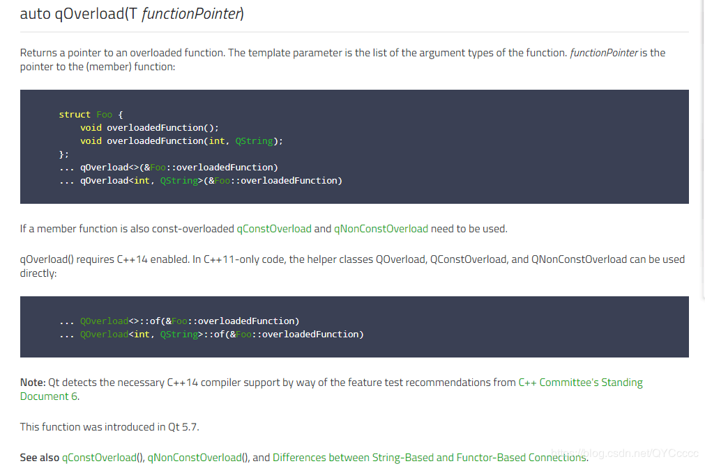

# UUID
```
#include <QUuid>
QString uuid = QUuid::createUuid().toString().replace("{", "").replace("-", "").toUpper();
```

<!--more-->

# MD5
```
#include <QCryptographicHash>
QString md5 = QCryptographicHash::hash("Biao", QCryptographicHash::Md5).toHex();
```

# 随机数
Qt5.10后推荐使用 **QRandomGenerator** 生成随机数，而不再推荐qrand()：
```
#include <QRandomGenerator>
QRandomGenerator::global()->generate();   //(0, MAX_INT)
QRandomGenerator::global()->bounded(100); //(0, 100)
```

# connect使用有重载的信号或槽函数
## 方法一: 使用`static_cast<>()`进行强制类型转换

以QSpinBox为例:
QSpinBox有一个重载信号void valueChanged(int i)和void valueChanged(const QString &text)。

```
使用connect(mySpinBox, &QSpinBox::valueChanged, mySlider, &QSlider::setValue)会编译报错，
因为编译器不知道该使用哪一个valueChanged信号。
```

正确使用
```
connect(mySpinBox, SIGNAL(valueChanged(int)), mySlider, SLOT(setValue(int));
或
connect(mySpinBox, static_cast<void (QSpinBox::*)(int)>(&QSpinBox::valueChanged), mySlider, &QSlider::setValue);
```

## 方法二


```
使用QOverload<>::of()或者qOverload<>()(需要C++14支持)
例如：connect(mySpinBox,QOverload<int>::of(&QSpinBox::valueChanged), mySlider,&QSlider::setValue);
```