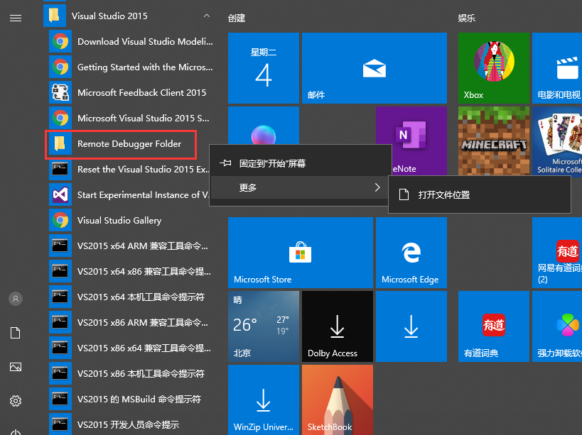
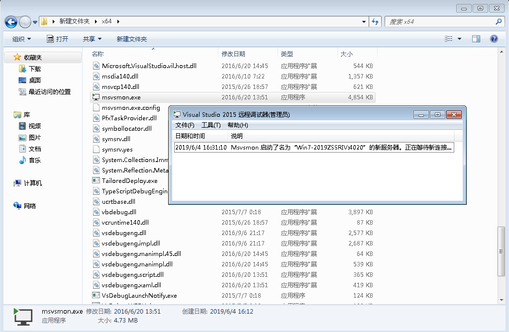
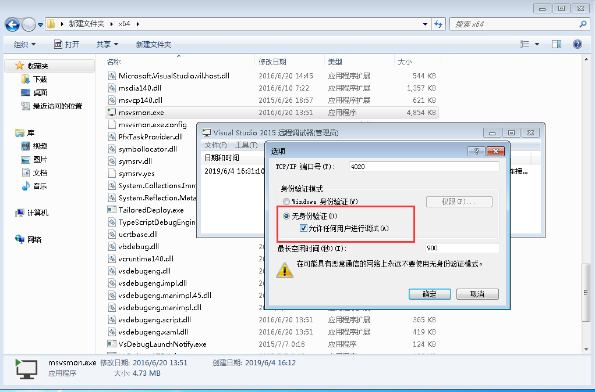
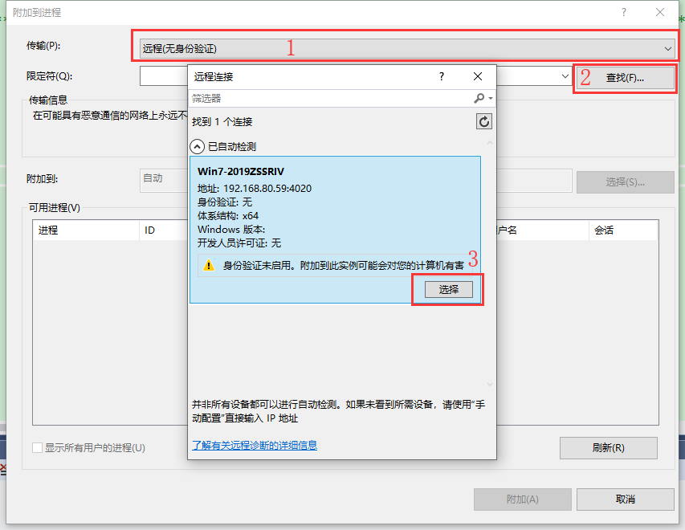
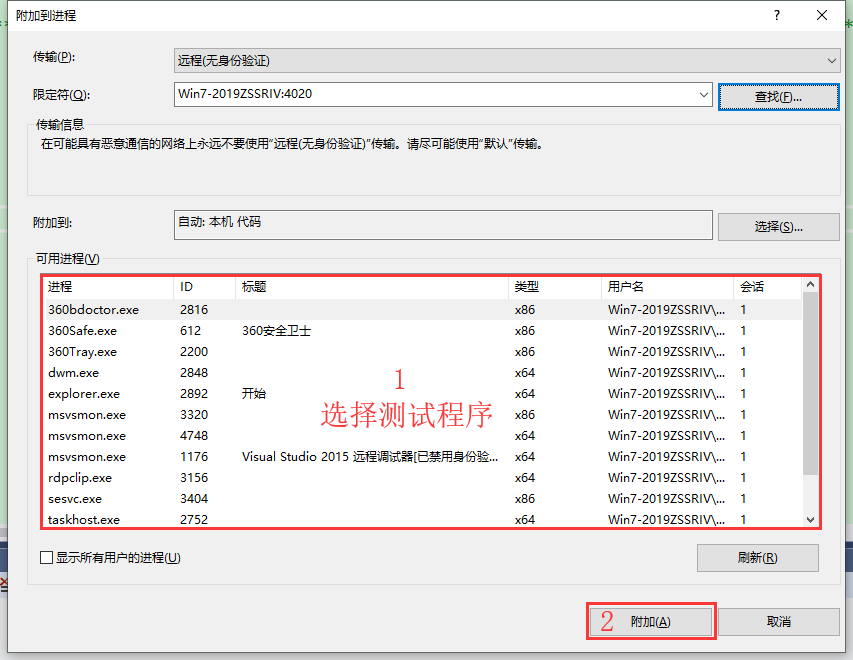
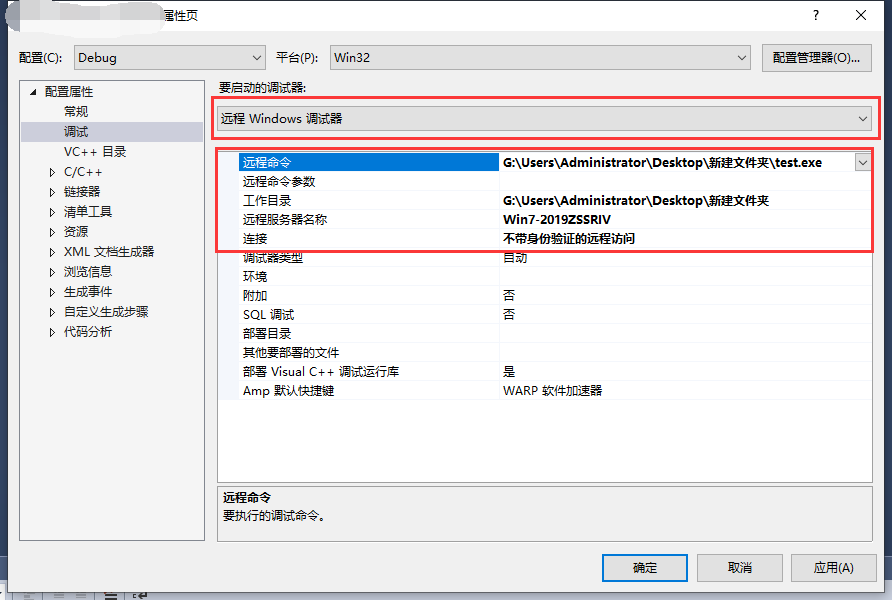

在自己的机器上运行正常，但是一到别人的机器上运行就异常。相信作为开发人员肯定遇到过这类问题。这时远程调试就能发挥作用了。
本文主要讲解Visual Studio 2015的远程调试功能。

<!--more-->

# 异常电脑设置
1、从开发的电脑(以下统称**电脑1**)中拷贝远程调试器至有异常的电脑(以下统称**电脑2**)
* 在电脑1开始菜单中找到Visual Studio 2015下的**Remote Debugger Folder**右键打开文件位置,如: D:\Program Files (x86)\Microsoft Visual Studio 14.0\Common7\IDE\Remote Debugger

* 根据电脑2的系统位数拷贝相应文件夹至电脑2中，如32位系统则拷贝x86文件夹，64位系统则拷贝x64文件夹

2、在电脑2中启动文件夹中的**msvsmon.exe**，记录显示的服务器名称，在开发电脑设置中的方法二中需要用到

3、在工具->选项中设置身份验证模式为无身份验证

4、关闭防火墙，详细步骤参考 <https://jingyan.baidu.com/article/17bd8e52083ce685ab2bb839.html>

5、将程序拷贝至电脑2中

# 开发电脑设置
启动远程调试主要有以下两种方式
## 方法一:
1、通过Visual Studio 2015中调试->附加到进程进行设置，设置如下图:

2、附加测试程序到进程

## 方法二:
1、右键项目->属性->调试，将要**启动的调试器**切换至**远程Windows调试器**
2、设置**远程命令**为测试程序在电脑2中的绝对路径(包含测试程序名称及后缀)
3、设置**工作目录**为测试程序在电脑2中所在的目录
4、设置**远程服务器名称**为msvsmon.exe中显示的服务器名称
5、设置**连接**为不带身份验证的远程访问

6、启动远程调试
