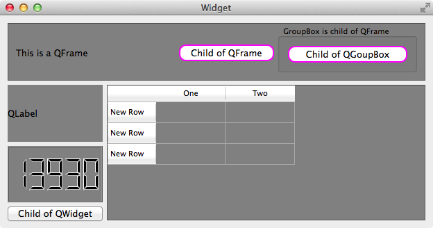

<!--more-->

选择器决定了 style sheet 作用于哪些 widget，QSS 支持 [CSS2 定义的所有选择器](https://www.w3.org/TR/CSS2/selector.html#q1)。

**QSS 的选择器有**
* 通用选择器 *
* 类型选择器
* 类选择器
* ID 选择器
* 属性选择器
* 包含选择器
* 子元素选择器
* 伪类选择器
* Subcontrol 选择器

很多时候，可以使用不同的选择器实现相同效果的样式，使用非常灵活。

# 通用选择器 *
`*` 作为选择器，作用于所有的 widget。

# 类型选择器
`类名` 作为选择器，作用于它自己和它的所有子类。
```
QFrame {
   background: gray;
}
```
使用了类型选择器 `QFrame`，所以 QFrame 和它的子类 QLable，QLCDNumber，QTableWidget 等的背景会是灰色的，QPushButton 不是 QFrame 的子类，所以不受影响：


# 类选择器
`. + 类名` 或者 `. + class` 的属性值 作为选择器（使用 setProperty(“class”, “QSSClassName”) 设置），只会作用于它自己，它的子类不受影响，注意和类型选择器的区别。
```
#include <QApplication>
#include <QPushButton>
#include <QHBoxLayout>

int main(int argc, char *argv[]) {
    QApplication app(argc, argv);

    app.setStyleSheet("QWidget { background: gray; }");

    QWidget *window = new QWidget();
    QPushButton *openButton  = new QPushButton("打开", window);
    QPushButton *closeButton = new QPushButton("关闭", window);
    QPushButton *saveButton  = new QPushButton("保存", window);

    QHBoxLayout *layout = new QHBoxLayout(window);
    layout->addWidget(openButton);
    layout->addWidget(closeButton);
    layout->addWidget(saveButton);
    window->setLayout(layout);
    window->show();

    return app.exec();
}
```
window, openButton, closeButton 和 saveButton 的背景都变成灰色的了，如果只想要 window 的背景是灰色的，按钮的背景不变，可以使用类选择器 `.QWidget`
```
/* 把 QWidget 改成 .QWidget */
app.setStyleSheet(".QWidget {background: gray;}")
```
如果 openButton 和 closeButton 的背景是洋红色的，但是 saveButton 不受影响，则可以使用 `. ＋ class 的属性值` 作为类选择器来设置
```
app.setStyleSheet(".QWidget { background: gray; }"
                  ".RedButton { background: magenta; }");

// .RedButton 将作为类选择器
openButton->setProperty("class",  "RedButton");
closeButton->setProperty("class", "RedButton");
```


# ID 选择器
`# + objectName` 作为选择器，只作用于用此 objectName 的对象（多个对象可以使用同一个 objectName，但是不推荐这么做，既然是 ID，那么语义上就表示唯一了）。如上面的程序， openButton 和 closeButton 的背景是洋红色的，但是 saveButton 不受影响，也可以使用 `ID 选择器` 来实现：
```
// #openButton 和 #closeButton 作为 ID 选择器
app.setStyleSheet(".QWidget { background: gray; }"
                  "#openButton, #closeButton { background: magenta; }");

openButton->setObjectName("openButton");
closeButton->setObjectName("closeButton");
```

# 属性选择器
`选择器[属性="值"]` 作为选择器，这个属性可用通过 `object->property(propertyName)` 访问的，Qt 里称为 `Dynamic Properties`。

如上面的程序， openButton 和 closeButton 的背景是洋红色的，但是 saveButton 不受影响，也可以使用属性选择器来实现：

```
app.setStyleSheet(".QWidget { background: gray; }"
                  "QPushButton[level='dangerous'] { background: magenta; }");

openButton->setProperty("level",  "dangerous");
closeButton->setProperty("level", "dangerous");
```
QSS 会把所有 QPushButton 中属性 level 值为 dangerous 按钮的背景绘制为洋红色，其他按钮的背景色不受这个 QSS 影响。

> 注意: 程序运行时属性值变化后 QSS 不会自动生效，需要调用 widget->setStyleSheet("/**/") 强制刷新 QSS 才行。

属性的值可以用单引号、双引号括起来，如果值没有空格甚至可以不用引号 (不推荐这么做)，以下三种写法都是有效的:

* **.QPushButton[level="dangerous"]**
* **.QPushButton[level='dangerous']**
* **.QPushButton[level=dangerous]**

# 包含选择器
英语叫做 `Descendant Selector`，descendant 的表达比较到位。

`选择器之间用空格隔开`，作用于 Widget 的 `子Widget`，`子Widget 的 子Widget`，……，子子孙孙，无穷尽也。

```
QFrame {
	background: gray;
}

/* 设置 QFrame 中的 QPushButton 的 QSS */
QFrame QPushButton {
    border: 2px solid magenta;
    border-radius: 10px;
    background: white;
    padding: 2px 15px;
}
```

顶部的 QPushButton 是 QFrame 的 descendant，所以 QSS 生效了，左下角的 QPushButton 的 parent 是 QWidget，所以 QSS 不起作用:



# 子元素选择器
`选择器之间用 > 隔开`，作用于 Widget 的 `直接 子Widget`，注意和包含选择器的区别。

```
QFrame {
	background: gray;
}

QFrame > QPushButton {
    border: 2px solid magenta;
    border-radius: 10px;
    background: white;
    padding: 2px 15px;
}
```

按钮 `Child of QGroupBox` 的 parent 是 QGroupBox，QGroupBox 的 parent 是 QFrame，所以 `Child of QGroupBox` 虽然是 QFrame 的 `子Widget 的 子Widget`，但不是 QFrame 的`直接 子Widget`，故 QSS 不起作用，而 按钮 `Child of QFrame` 的 parent 是 QFrame，所以它的样式改变了:


# 伪类选择器
`选择器:状态` 作为选择器，支持 `!` 操作符，表示 `非`。

```
QPushButton:hover { color: white }
QCheckBox:checked { color: white }
QCheckBox:!checked { color: red }
```
鼠标放到 QPushButton 上时，它的文字为白色，QCheckBox 选中时文字为白色，未选中时为红色。

伪类选择器还支持链式规则：`选择器:状态1:状态2:状态3`，状态之间使用逻辑与，同时满足条件样式才生效​

```
QCheckBox:hover:checked { color: white }
```
鼠标 `放到` `选中的` QCheckBox 上时，它的字体为白色。

**常用伪类选择器有：**

伪类|说明|
:-|:-|
:disabled|	Widget 被禁用时
:enabled|	Widget 可使用时
:focus|	Widget 得到输入焦点
:hover|	鼠标放到 Widget 上
:pressed|	鼠标按下时
:checked|	被选中时
:unchecked|	未选中时
:has-children|	Item 有子 item，例如 QTreeView 的 item 有子 item 时
:has-siblings|	Item 有 兄弟，例如 QTreeView 的 item 有兄弟 item 时
:open|	打开或展开状态，例如 QTreeView 的 item 展开，QPushButton 的菜单弹出时
:closed|	关闭或者非展开状态
:on	Widget| 状态是可切换的（toggle）, 在 on 状态
:off|	Widget 状态是可切换的（toggle）, 在 off 状态
伪类的说明写成中文怎么感觉都很别扭，惭愧，表达能力欠佳，在此仅作为抛砖引玉吧，更多更详细的内容请参考 Qt 的帮助文档，搜索 Qt Style Sheets Reference，查看最下面的 List of Pseudo-States。

当然，这些伪类并不是对任何 widget 都起作用，例如 QLabel 没有 :checked 状态，即使设置了样式 QLabel:checked {color: red}，对 QLabel 也是没有效果的，只有 widget 支持某个状态，那么对应的伪类的样式才有作用。

Subcontrol 选择器
选择器::subcontrol 作为选择 Subcontrol 的选择器。

有些 widget 是由多个部分组合成的，例如 QCheckBox 由 icon(indicator) 和 text 组成，可以使用 选择器::subcontrol 来设置 subcontrol 的样式：

1
2
3
4
5
6
7
8
QCheckBox::indicator {
    width: 20px;
    height: 20px;
}

QCheckBox {
    spacing: 8px;
}


常用的 Subcontrol 有:

Subcontrol	说明
::indicator	A QCheckBox, QRadioButton, checkable QMenu item, 
or a checkable QGroupBox’s indicator
::menu-indicator	A QPushButton’s menu indicator
::item	A QMenu, QMenuBar, or QStatusBar’s item
::up-button	A QSpinBox or QScrollBar’s up button
::down-button	A QSpinBox or QScrollBar’s down button
::up-arrow	A QSpinBox, QScrollBar, or QHeaderView’s up arrow
::down-arrow	A QSpinBox, QScrollBar, or QHeaderView’s down arrow
::drop-down	A QComboBox’s drop-down arrow
::title	A QGroupBox or QDockWidget’s title
::groove	A QSlider’s groove
::chunk	A QProgressBar’s progress chunk
::branch	A QTreeView’s branch indicator
Subcontrol 选择器的应用比较复杂，所以专门开辟了 QSS Subcontrol 一章来介绍。