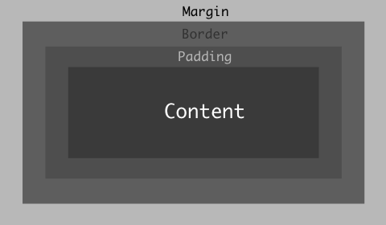
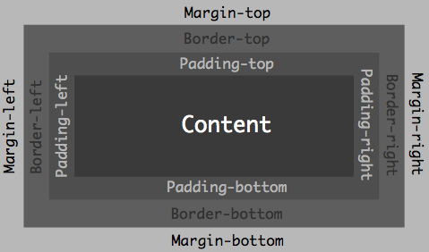
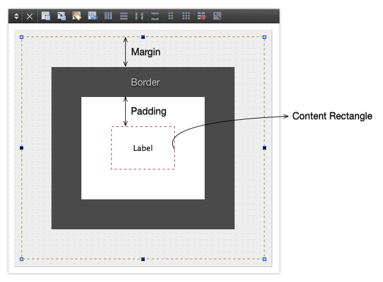
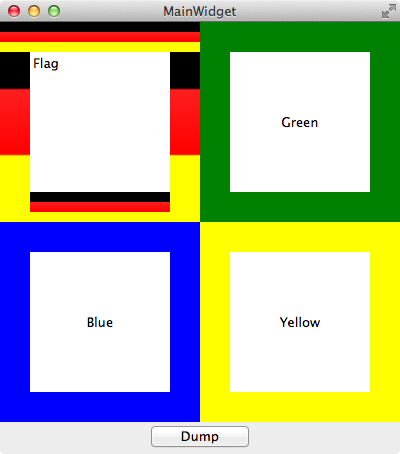
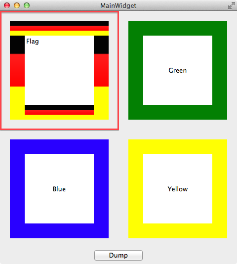
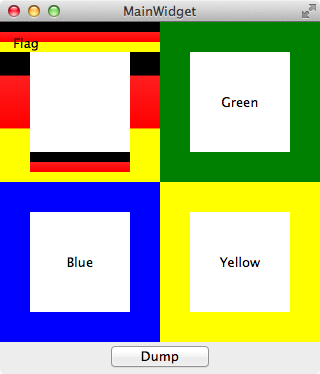
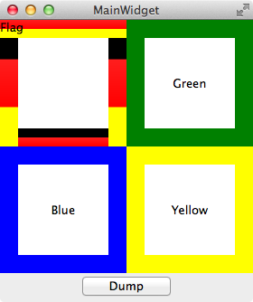

每个 Widget 所在的范围都是一个矩形区域（无规则窗口也是一个矩形，只是有的地方是透明的，看上去不是一个矩形），像是一个盒子一样。QSS 支持盒子模型（Box Model），和 CSS 的盒子模型是一样的，由 4 个部分组成：content, padding, border, margin，也就是说，Widget 的矩形区域，用这 4 个矩形表示

<!--more-->



* `content`: 绘制内容的矩形区域（如绘制文本、图片），Qt 自带的 widget 都是在 content 区里绘制内容，这只是一个约定，只要你愿意，也可以在绘制到 padding, border, margin 区
* `padding`: 内容区和边框之间的间隔
* `border`: 边框，可视化的显示一个 widget 的逻辑范围，而不一定是 widget 所占矩形区域的实际大小
* `margin`: 想像 widget 的矩形区域有一个隐形的边框，margin 就是 border 和这个隐形边框之间的间隔

QWidget 的 content, padding, border, margin 的矩形区域都是一样大的，也就是说，margin, border, padding 的值为 0，content 的矩形和 QWidget 的矩形一样大，但是 QPushButton 默认的 margin, border, padding 的值不为 0（可以试试 `setFlat(true)` 后再看看这几个值是什么）。

Margin，Border，Padding 都分为 4 个部分：上、右、下、左，它们的值可以不同：


## padding 的语法
* `padding: 2px 3px 4px 5px` 表示:
 * padding-top 为 2px
 * padding-right 为 3px
 * padding-bottom 为 4px
 * padding-left 为 5px


*  `padding: 2px 4px` 表示:
 * padding-top 和 padding-bottom 为 2px
 * padding-right 和 padding-left 为 4px


* `padding: 2px` 表示:
 * padding-top、padding-right、padding-bottom、padding-left 都为 2px

margin 的语法和 padding 的一样，border 除了分成 4 个部分外，还有颜色，圆角等。
也许你也有和我一样的疑问，为什么上面表示的顺序不是从左开始，而是从上开始？对我来说，从左开始更习惯一些，但是 CSS 和 QSS 里就是这么规定的，没办法，既然不能反抗，那么就享受吧！

## padding 是什么
可能你还是不明白 margin, padding 具体是什么，下面用例子具体的的介绍它们。在 Qt Designer 里用 QGridLayout 布局，拖放一个 QLabel 到窗口上，让其占据整个窗口，用下面的 QSS 把 QLabel 的 margin, border, padding 都设置为 50px：
```
QLabel {
    margin: 50px;
    border: 50px solid rgb(74, 74, 74);
    padding: 50px;
    background: white;
}
```



### 在 Qt Designer 里选中 QLabel:
* 8 个蓝色小方块内就是 QLabel，外面是 parent widget 的，不属于 QLabel
* 标记为 margin 的部分是 margin，为 50px
* 标记为 padding 的部分是 padding，为 50px
* 用工具测量一下，得到 border 的宽也是 50px
* 小虚线方框内是 content rectangle，QLabel 就是在它里面绘制文本，图片等，不会绘制到 padding, border, margin 等上面（如果你自己想继承 QLabel 然后绘制到它们上面当然没问题）
* 当拖动修改窗口的大小后，QLabel 的大小随着改变了，但是 margin, border（宽）, padding 的大小都不会变，变化的只有 content rectangle
* Margin 是不可见的，不绘制任何东西
* Padding 是不可见的，但是 QLabel 的背景会绘制到它里面
* Border 是可见的，在背景上面绘制 border（如果 border 是半透明的时候可以看到和背景的融合效果），也就是说，背景会绘制到 padding, border, content 3 个部分上
* Content 是可见的，在背景上绘制 QLabel 的内容：文本，图片

## 计算 border 和 content 的矩形
Padding 和 margin 都是不可见的，用它们来控制间隔，让绘制的效果更好，只有 border 和 content 是可见的。Border 和 content 要绘制在它们自己的矩形区域内，那么这些矩形怎么计算呢？Content 的矩形一定要在 border 的矩形内吗？

> **设定**
* Widget 的矩形为 widgetRect，其实就是 (0, 0, width, height)
* Border 的矩形为 borderRect
* Content 的矩形为 contentRect

```
// 计算 border 的矩形
borderRect.x = marginLeft
borderRect.y = marginTop
borderRect.width  = widgetRect.width  - marginLeft - marginRight
borderRect.height = widgetRect.height - marginTop  - marginBottom

// 计算 content 的矩形
contentRect.x = marginLeft + borderLeft + paddingLeft
contentRect.y = marginTop  + borderTop  + paddingTop
contentRect.width  = widgetRect.width -
    marginLeft     - borderLeft   - paddingLeft -
    paddingRight   - borderRight  - marginRight;
contentRect.height = widgetRect.height -
    marginTop      - borderTop    - paddingTop -
    paddingBottom  - borderBottom - marginBottom;
```

> **为了简单起见，下面的 margin 指的是它对应的 4 个值，而且都一样大，padding 也一样:**
* Margin 大于 0 时，borderRect 在 widgetRect 内
* Margin 小于 0 时，borderRect 包含 widgetRect
* Padding 大于 0 时，contentRect 在 borderRect 内
* Padding 小于 0 时，contentRect 和 borderRect 中绘制 border 的区域相交，甚至包含 borderRect

Qt 绘制自带的 Widget 时，先绘制 border，然后才绘制 content 的内容，所以，padding 小于 0 时，可以看到 content 绘制到了 border 上，在 Border-Image 一节里，就会使用这个特点，使得实现的效果更好。

> **需要注意的是:**
* QWidget::contentsRect() 和上面的 contentRect 一样
* QWidget::contentsMargins() 不是 margin，而是 margin + border + padding 的和: content 离边框的距离
* QWidget::size() 返回的是 margin + border + padding + content 的和
* 需要注意一点: QSS 中设置的 width, height, min-width, max-height 等设置的都是 content width 和 content height，而 QWidget::size() 返回的却是整个 QWidget 的大小

## 可视化盒子模型
下面的程序，可以直观地验证盒子模型的理论，有助于加深理解，界面虽然俗气了点，但效果却是不凡，正所谓：大俗即大雅。顶级窗口的 content margin 和 spacing 设置为 0，有 4 个 QLabel，它们只有 border 的颜色不一样，还有一个 QPushButton，按下 QPushButton 时输出左上角 flagLabel 的 size(), contentsRect() 和 contentsMargins()

```
MainWidget::MainWidget(QWidget *parent) :
    QWidget(parent), ui(new Ui::MainWidget) {
    ui->setupUi(this);

    // 为了简化代码，使用了 C++11 才支持的 Lambda 语法的信号槽连接
    connect(ui->dumpButton, &QPushButton::clicked, [this]() {
        qDebug() << "Label size: " << ui->flagLabel->size();
        qDebug() << "Contents rect: " << ui->flagLabel->contentsRect();
        qDebug() << "Contents margins: " << ui->flagLabel->contentsMargins();
    });
}
```

```
QLabel {
    margin: 0px;
    padding: 0px;
    border-width: 30px;
    border-style: solid;
    background: white;
    min-width: 140px;  /* 设置 content rect 的最小 width，不是 widget 的 width() */
    min-height: 140px; /* 设置 content rect 的最小 heightd，不是 widget 的 height()*/
}

#flagLabel {
    border-color: qlineargradient(
    spread:pad, x1:0,
    y1:0, x2:0, y2:1,
    stop:0 rgba(0, 0, 0, 255),
    stop:0.33 rgba(0, 0, 0, 255),
    stop:0.34 rgba(255, 30, 30, 255),
    stop:0.66 rgba(255, 0, 0, 255),
    stop:0.67 rgba(255, 255, 0, 255),
    stop:1 rgba(255, 255, 0, 255));
}

#greenLabel {
    border-color: green;
}

#blueLabel {
    border-color: blue;
}

#yellowLabel {
    border-color: yellow;
}
```


初始 QSS 如上，效果为:


> 点击 Dump 按钮，输出:
  Label size: QSize(200, 200)
  Contents rect: QRect(30,30 140x140)
  Contents margins: QMargins(30, 30, 30, 30)

> **由于 margin 为 0px，padding 为 0px，border-width 为 30px, 所以:**
* **label width**：0 + 30 + 0 + 140 + 0 + 30 + 0，为 200
* **label height**：0 + 30 + 0 + 140 + 0 + 30 + 0，为 200
* **content rect 的 x**: 0 + 30 + 0，为 30
* **content rect 的 y**: 0 + 30 + 0，为 30
* **content margin**：0 + 30，为 30
************

修改 `margin: 20px; padding: 0px;`，效果为:


> 点击 Dump 按钮，输出:
  Label size: QSize(240, 240)
  Contents rect: QRect(50,50 140x140)
  Contents margins: QMargins(50, 50, 50, 50)

> **由于 margin 为 20px，padding 为 0px，所以**
* **label width**：20 + 30 + 0 + 140 + 0 + 30 + 20，为 240
* **label height**：20 + 30 + 0 + 140 + 0 + 30 + 20，为 240
* **content rect 的 x**: 20 + 30 + 0，为 50
* **content rect 的 y**: 20 + 30 + 0，为 50
* **content margin**：20 + 30 + 0，为 50

左上角 QLabel 的大小为红框括起来的范围，而不是可见的 border 括起来的范围，因为 margin 为 20px。
************

修改 `margin: 0px; padding: -20px;`，效果为:


> 点击 Dump 按钮，输出:
  Label size: QSize(160, 160)
  Contents rect: QRect(10,10 140x140)
  Contents margins: QMargins(10, 10, 10, 10)

> **由于 margin 为 0px，padding 为 -20px，所以:**
*  **label width**：0 + 30 + -20 + 140 + -20 + 30 + 0，为 160
* **label height**：0 + 30 + -20 + 140 + -20 + 30 + 0，为 160
* **content rect 的 x**: 0 + 30 + -20，为 10
* **content rect 的 y**: 0 + 30 + -20，为 10
* **content margin**：0 + 30 + -20，为 10

contentRect 和 borderRect 中绘制 border 的区域相交，所以 QLabel 的文本 Flag 被绘制到了 border 上面。
**************

修改 `margin: -10px; padding: -20px;`，效果为：


> 点击 Dump 按钮，输出:
  Label size: QSize(140, 140)
  Contents rect: QRect(0,0 140x140)
  Contents margins: QMargins(0, 0, 0, 0)

> **由于 margin 为 -10px，padding 为 -20px，所以**
* **label width**：-10 + 30 + -20 + 140 + -20 + 30 + -10，为 140
* **label height**：-10 + 30 + -20 + 140 + -20 + 30 + -10，为 140
* **content rect 的 x**: -10 + 30 + -20，为 0
* **content rect 的 y**: -10 + 30 + -20，为 0
* **content margin**：-10 + 30 + -20，为 0

因为 margin 为 -10px，border-width 为 30px，所以上边的 border 应该从 (-10, -10) 开始绘制，有三分之一给绘制到了 QLabel 的不可见区域，所以从图中看不到，这里我们使用了一个三色的 border，能直观的看到 border 的变化。

QSS 里盒子模型是很关键的，相信大家现在已经明白了，但是，古人云：纸上得来终觉浅，绝知此事要躬行，请自己尝试修改不同的 margin, border, padding, min-width, min-height 等，计算、对比输出的结果，这样才会有更深刻的体会。


原文地址：https://qtdebug.com/qtbook-qss-boxmodel/ 博主狗哥的其他博文也写的非常好，从他这里学到了很多，需要的同学可以去看看https://qtdebug.com/qtbook/