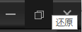

在开发过程中经常碰到控件在不同情况下需要不同的状态显示，在没了解Qt动态属性的用法时，我都是在代码中用setStyleSheet根据不同情况设置不同的样式，这种做法比较麻烦，而且不够灵活。

# 示例
接下来以窗口最大化/还原按钮为例进行示例说明。

 


<!--more-->


# 源码
```
void Widget::setMaxButtonProperty()
{
	m_buttonMax->setProperty("maximizeProperty", this->isMaximized() ? true : false);

	m_buttonMax->style()->unpolish(m_buttonMax);	//先卸载之前的样式
	m_buttonMax->style()->polish(m_buttonMax);	//重新加载样式
或者
//	m_buttonMax->setStyle(QApplication::style())	

	m_buttonMax->update();
}
```
如果之前已经设置了样式，需要重新设置时需要调用unpolish卸载之前的样式，当前你也可以直接使用`setStyle(QApplication::style())`一步到位

# Qss
```
QPushButton#title_max[maximizeProperty=false]
{
	width: 40px;
	height: 40px;
	background: transparent;
	border-image: url("://img/title/btn_max_normal.png")
}
QPushButton#title_max[maximizeProperty=false]:hover
{
	border-image: url("://img/title/btn_max_hover.png")
}
QPushButton#title_max[maximizeProperty=true]
{
	width: 40px;
	height: 40px;
	background: transparent;
	border-image: url(":/img/title/btn_maxTonormal_normal.png")
}
QPushButton#title_max[maximizeProperty=true]:hover
{
	border-image: url(":/img/title/btn_maxTonormal_hover.png")
}
```

参考博文：https://blog.csdn.net/liang19890820/article/details/51693956