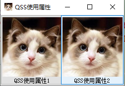

# 动态属性
在开发过程中经常碰到控件在不同情况下需要不同的状态显示，在没了解Qt动态属性的用法时，我都是在代码中用setStyleSheet根据不同情况设置不同的样式，这种做法比较麻烦，而且不够灵活。

## 示例
接下来以窗口最大化/还原按钮为例进行示例说明。

 


<!--more-->


## 源码
```
void Widget::setMaxButtonProperty()
{
	m_buttonMax->setProperty("maximizeProperty", this->isMaximized() ? true : false);

	m_buttonMax->style()->unpolish(m_buttonMax);	//先卸载之前的样式
	m_buttonMax->style()->polish(m_buttonMax);	//重新加载样式
或者
//	m_buttonMax->setStyle(QApplication::style())	

	m_buttonMax->update();
}
```
如果之前已经设置了样式，需要重新设置时需要调用unpolish卸载之前的样式，当前你也可以直接使用`setStyle(QApplication::style())`一步到位

## Qss
```
QPushButton#title_max[maximizeProperty=false]
{
	width: 40px;
	height: 40px;
	background: transparent;
	border-image: url("://img/title/btn_max_normal.png")
}
QPushButton#title_max[maximizeProperty=false]:hover
{
	border-image: url("://img/title/btn_max_hover.png")
}
QPushButton#title_max[maximizeProperty=true]
{
	width: 40px;
	height: 40px;
	background: transparent;
	border-image: url(":/img/title/btn_maxTonormal_normal.png")
}
QPushButton#title_max[maximizeProperty=true]:hover
{
	border-image: url(":/img/title/btn_maxTonormal_hover.png")
}
```

# 原始属性
任何被Q_PROPERTY声明的属性都能在QSS中使用`qproperty-<property name>`语法进行设置。

以QToolButton为例，QToolButton继承至QAbstractButton，QAbstractButton拥有以下被Q_PROPERTY声明的属性,子类也可通过QSS使用父类中被Q_PROPERTY声明的属性,如下，text、icon、iconSize等属性均可在QSS中使用。
```
class Q_WIDGETS_EXPORT QAbstractButton : public QWidget
{
    Q_OBJECT

    Q_PROPERTY(QString text READ text WRITE setText)
    Q_PROPERTY(QIcon icon READ icon WRITE setIcon)
    Q_PROPERTY(QSize iconSize READ iconSize WRITE setIconSize)
#ifndef QT_NO_SHORTCUT
    Q_PROPERTY(QKeySequence shortcut READ shortcut WRITE setShortcut)
#endif
    Q_PROPERTY(bool checkable READ isCheckable WRITE setCheckable)
    Q_PROPERTY(bool checked READ isChecked WRITE setChecked DESIGNABLE isCheckable NOTIFY toggled USER true)
    Q_PROPERTY(bool autoRepeat READ autoRepeat WRITE setAutoRepeat)
    Q_PROPERTY(bool autoExclusive READ autoExclusive WRITE setAutoExclusive)
    Q_PROPERTY(int autoRepeatDelay READ autoRepeatDelay WRITE setAutoRepeatDelay)
    Q_PROPERTY(int autoRepeatInterval READ autoRepeatInterval WRITE setAutoRepeatInterval)
    Q_PROPERTY(bool down READ isDown WRITE setDown DESIGNABLE false)
	....
}
```

## 示例
```
QToolButton
{ 
	qproperty-text: "QSS使用属性1";
	qproperty-icon: url(://img/:cat.png);
	qproperty-iconSize: 121px 121px;
}
```

## 效果图


参考博文：https://blog.csdn.net/liang19890820/article/details/51693956