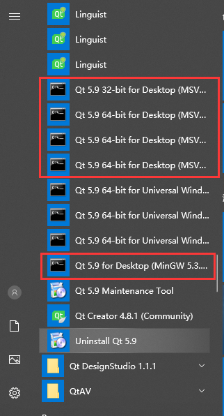
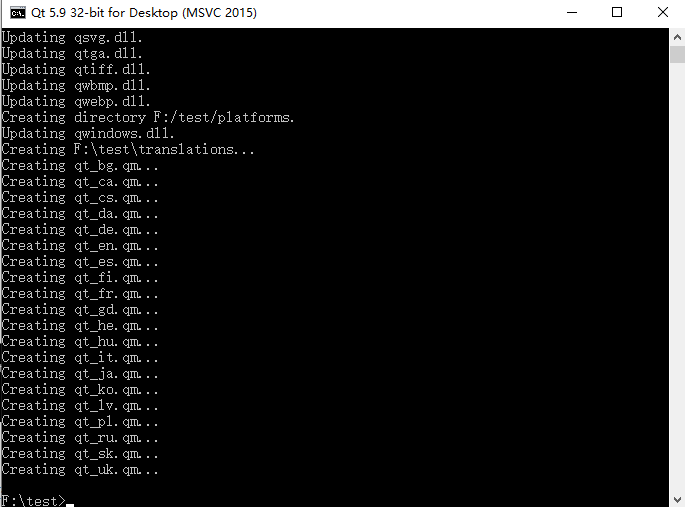
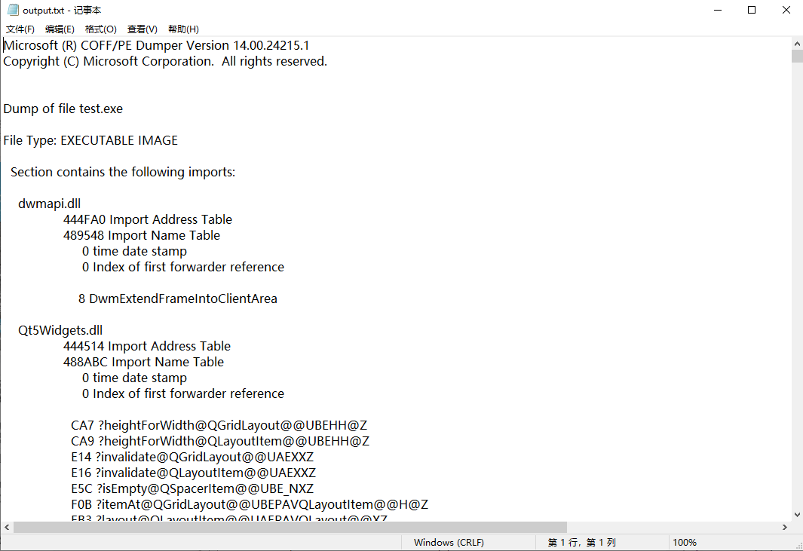

当你历尽艰辛终于把"bug"写完，兴致勃勃的发给基友炫耀时，结果你的"bug"在基友电脑上跑不起来，提示缺少一堆dll，然后被基友一顿嘲讽，是不是很绝望？哈哈，不怕，看完这篇文章，基友就再也找不到嘲讽你的理由了，保不齐像牛皮糖样的崇拜你。

<!--more-->

# 查找DLL
1、在开始菜单Qt 5.9.0(根据自己的版本)中根据自己使用的编译器打开相应的命令行工具,如`MinGW`打开`Qt x.x for Desktop(MinGw ...)`、`MSVC`则打开`Qt x.x 32-bit for Desktop(MSVC 2015)`(位数和MSVC版本需要根据自己实际情况选择)

以`Qt 5.9 32-bit for Desktop(MSVC 2015)`为例。
* 将需要打包的exe文件放入一个单独的文件夹中(我的文件夹为F:\test)
* 使用命令"cd /d F:\test"跳转到exe文件路径
* 使用命令"windeployqt test.exe"会将大部分需要的DLL拷贝到exe目录中(我的exe名称为test)
如下图则表示命令执行成功

完成这步可以保证你的程序在大部分电脑上运行，但是并不是全部，想要确保在全部电脑上能够运行，还要使用Visual Studio自带的dumpbin工具查找程序需要的DLL文件。

2、在开始菜单Visual Studio 2015中根据软件位数打开相应的命令行工具。
* 使用命令"cd /d F:\test"跳转到exe文件路径
* 使用命令"dumpbin /IMPORTS test.exe > output.txt"将所需的DLL文件写入output.txt文本中
* 根据output.txt文本中内容查找并拷贝所需的DLL到软件所在文件夹中

推荐一款查找软件[Listary](https://www.listary.com/)